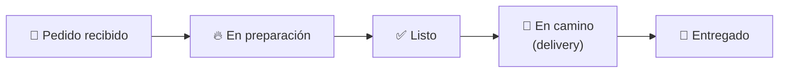

# 🔍 Análisis de Funcionalidades Faltantes — Sudamérica AI

> [!NOTE]
> Este análisis se basa en la revisión exhaustiva de **31 servicios**, **5 sub-agentes**, **4 microservicios**, y todo el pipeline de WhatsApp. Comparo lo que existe vs. lo que falta para ser un producto SaaS competitivo en el vertical de restaurantes.

---

## Estado Actual: Lo Que YA Funciona Bien

Antes de hablar de lo que falta, es importante reconocer que la base es **sólida**:

| Área | Estado | Detalle |
|------|--------|---------|
| Toma de pedidos vía IA | ✅ Completo | Cotizador + auto-comanda + modificadores |
| Reservas multi-turno | ✅ Completo | FSM con 4 estados, verificación de disponibilidad |
| Delivery end-to-end | ✅ Completo | Claim por grupo WhatsApp, FSM de estados |
| Mesa QR → WhatsApp | ✅ Completo | Token QR, contexto de mesa, polls interactivos |
| Fidelización básica | ✅ Completo | Tiers automáticos (NUEVO→VIP), stats por lead |
| Outreach de lealtad | ✅ Completo | Reactivación automática de VIP/FRECUENTE |
| Revisión humana | ✅ Completo | Claim atómico, aprobación/edición/rechazo |
| Knowledge Base | ✅ Completo | Teach, test, RAG |
| Inventario | ✅ Completo | Suministros, recetas, decremento automático |
| Métricas operativas | ✅ Completo | Revenue, KPIs, menu engineering, segmentación |
| Multi-tenant + RLS | ✅ Completo | Aislamiento por tenant_id |
| Pagos SaaS | ✅ Completo | Stripe checkout, webhooks, upgrade/downgrade |

---

## 🔴 P0: Funcionalidades Críticas Faltantes

### 1. Notificaciones al Cliente sobre Estado del Pedido

**El problema:** El cliente pide comida vía WhatsApp, la IA confirma... y después **silencio total**. No hay notificación de "Tu pedido entró a cocina", "Tu pedido está listo", ni "Tu repartidor va en camino".

**Impacto:** El cliente vuelve a escribir "¿dónde está mi pedido?" y la IA no tiene información real de estado. Genera frustración y más carga al sistema.

**Qué implementar:**

- En cada transición de `comanda_svc.transition_estado()`, enviar WhatsApp al cliente
- El `seguimiento_agent` debe poder consultar el estado real de la comanda cuando el cliente pregunte
- Plantillas personalizables por tenant: *"🔥 Tu pedido #{num} está en preparación. Estimado: ~{min} minutos"*

**Archivos a modificar:**
- [comanda_svc.py](file:///d:/Sudamérica.AI/MVP/MVP/backend/api_execute/app/services/comanda_svc.py) — hook en `transition_estado()`
- Crear `comanda_notify_customer.py` — notificaciones al cliente
- [seguimiento_agent.py](file:///d:/Sudamérica.AI/MVP/MVP/backend/AI_dialer/app/services/seguimiento_agent.py) — consulta de estado real

---

### 2. Pago Integrado en la Conversación

**El problema:** El cotizador pregunta método de pago pero no puede generar un link de pago. Stripe está implementado pero **solo para el SaaS** (upgrade de plan), no para que los clientes del restaurante paguen.

**Impacto:** El restaurante pierde ventas delivery por fricción: el cliente tiene que transferir manualmente y avisar.

**Qué implementar:**
- Integrar **Mercado Pago / Flow / Transbank WebPay** (no Stripe — son pagos en CLP/LATAM)
- La IA genera un link de pago cuando el cliente confirma un delivery:
  *"Tu pedido total es $12.900. Aquí tienes tu link de pago: [link]. ¡Apenas confirmes, enviamos tu pedido! 🚀"*
- Webhook de confirmación de pago → auto-cambiar estado de comanda a `EN_COCINA`

---

### 3. Encuestas de Satisfacción Post-Servicio

**El problema:** No hay feedback loop. El restaurante no sabe si el cliente quedó satisfecho.

**Impacto:** Sin NPS ni feedback, no se puede mejorar el servicio ni detectar problemas recurrentes.

**Qué implementar:**
- Trigger automático X minutos después de `ENTREGADO`
- Poll de WhatsApp: *"¿Cómo calificarías tu experiencia? ⭐⭐⭐⭐⭐"*
- Si calificación < 3: alerta automática al admin + ofrecer disculpa
- Almacenar en tabla `satisfaction_surveys` para analytics
- Agregar métrica de NPS al dashboard

---

### 4. Historial de Pedidos para el Cliente ("Lo de Siempre")

**El problema:** La intención `FIDELIDAD` existe y el `seguimiento_agent` tiene `plato_favorito`, pero el cliente **no puede pedir "lo de siempre"** porque el cotizador no tiene acceso al historial de comandas anteriores.

**Impacto:** Los clientes recurrentes (VIP/FRECUENTE) son los más valiosos y la IA no los reconoce como tal al momento de pedir.

**Qué implementar:**
- Cuando classifier detecta `FIDELIDAD`, pasar el historial de últimas 3-5 comandas al cotizador
- La IA puede ofrecer: *"¡Hola Juan! ¿Quieres repetir tu pedido habitual? 2x Churrasco Italiano + Limonada. ¿O prefieres algo diferente?"*
- Implementar `[REPETIR_ULTIMO_PEDIDO]` como marker especial

---

## 🟡 P1: Funcionalidades Importantes

### 5. Campañas Masivas Programables

**Lo que existe:** `loyalty_outreach.py` envía mensajes a clientes en riesgo, pero es un trigger manual/cron.

**Lo que falta:**
- UI para crear campañas: selección de segmento, mensaje personalizado, fecha/hora de envío
- Templates aprobados por WhatsApp Business API (para evitar bans con Evolution)
- Métricas de campaña: enviados, leídos, respondidos, conversiones
- A/B testing de mensajes

---

### 6. Tiempo Estimado de Espera Real

**El problema:** La IA dice *"Tu pedido estará listo en ~30 minutos"* basándose en un valor estático (`tiempo_estimado_preparacion` en agente_config). No refleja la carga real de la cocina.

**Qué implementar:**
- Calcular basándose en: `comandas_abiertas × tiempo_base + prioridad`
- El KDS ya tiene los datos reales (`PENDIENTE`, `EN_COCINA`, `LISTO`)
- Inyectar en el system prompt: *"Actualmente hay {N} pedidos en cola, tiempo estimado: ~{X} minutos"*

---

### 7. Sistema de Cupones / Promociones

**El problema:** No hay sistema de descuentos. El restaurante no puede ofrecer "10% de descuento en tu primer pedido" ni códigos promocionales.

**Qué implementar:**
- Tabla `promotional_codes`: código, tipo (% o fijo), condiciones, vigencia
- El cotizador valida y aplica cupones automáticamente cuando el cliente menciona un código
- Cupones automáticos por acción: primera compra, cumpleaños, reactivación de inactivo
- Vinculación con campañas de outreach

---

### 8. Multi-Canal Más Allá de WhatsApp

**Lo que existe:** Arquitectura preparada (`canal` en comanda, lead, etc.) pero solo WhatsApp funciona.

**Lo que falta:**
- **Instagram DMs** — Meta Graph API, similar a WhatsApp
- **Widget Web** — Ya hay WebSocket en ai_dialer pero no hay widget embeddable
- **Telegram** — Bot API, relativamente simple
- Unificar historial de conversación cross-canal (un lead, múltiples canales)

---

### 9. Recordatorios de Reserva

**El problema:** Se crea la reserva, se envía confirmación, y eso es todo. No hay reminder.

**Qué implementar:**
- Enviar recordatorio 24h antes: *"¡Recuerda tu reserva mañana a las 20:00 para 4 personas en [restaurante]!"*
- Enviar recordatorio 2h antes con opción de cancelar
- Si el cliente no se presenta: marcar como no-show, afectar scoring de fidelidad
- Scheduler via Cloud Tasks o cron job

---

### 10. Reconocimiento de Imágenes

**El problema:** El cliente envía una foto de un plato y la IA no puede procesarla. El campo `media_type: image` se recibe pero no se analiza.

**Qué implementar:**
- Vision API (GPT-4o ya lo soporta): el cliente envía foto → la IA identifica el plato
- Caso de uso: *"¿Tienen algo parecido a esto?"* → La IA busca en el catálogo
- Otro caso: foto del menú en PDF/imagen → auto-importar productos (ya existe `menu_import_svc.py` pero solo para texto/CSV)

---

## 🟢 P2: Funcionalidades de Diferenciación

### 11. Analytics de Rendimiento de la IA

**Lo que existe:** Métricas básicas en `metrica_svc.py` (tokens, auto-resolución, ROI).

**Lo que falta:**
- **Preguntas sin resolver:** Log de mensajes donde `confianza < umbral` que no fueron aprobados
- **Temas frecuentes:** Clustering de intenciones para ver qué preguntan más los clientes
- **Tasa de abandono:** Clientes que inician pedido pero no confirman
- **Funnel de conversación:** Primer mensaje → Explorar menú → Agregar items → Confirmar
- **Precisión del clasificador:** Comparar intención predicha vs. real (basado en revisión humana)

---

### 12. Alergias y Restricciones Alimentarias

**Lo que falta:**
- Perfil de alergias por lead (almacenar en campo de leads)
- El cotizador alerta automáticamente: *"⚠️ Este plato contiene maní. ¿Estás seguro?"*
- Filtros en el catálogo: vegetariano, vegano, sin gluten, sin lactosa
- Tags en productos: `alergenos = ["mani", "lactosa", "gluten"]`

---

### 13. Horarios y Disponibilidad Dinámica

**El problema:** La IA dice *"Estamos abiertos de 12 a 22h"* basándose en knowledge base estática. Si el restaurante cierra temprano, la IA sigue tomando pedidos.

**Qué implementar:**
- Tabla `horarios_operacion`: día, hora_apertura, hora_cierre, por sucursal
- La IA verifica en tiempo real: si está cerrado → *"Lo siento, estamos cerrados. Abrimos mañana a las 12:00. ¿Quieres reservar?"*
- Menú por horario: desayuno, almuerzo, cena (categorías con rango horario)

---

### 14. Webhooks Salientes para Integraciones

**El problema:** Los restaurantes usan POS, ERP, o sistemas propios que no tienen forma de recibir eventos de Sudamérica AI.

**Qué implementar:**
- Configuración de webhook por tenant: URL + eventos suscritos
- Eventos: `comanda.created`, `comanda.entregado`, `reserva.created`, `lead.nuevo`
- Retry con backoff exponencial
- Panel de logs de webhooks enviados

---

### 15. Chat desde el Dashboard (Widget Interno)

**Lo que existe:** WebSocket para broadcast de eventos.

**Lo que falta:**
- Que el operador humano pueda intervenir en la conversación en tiempo real desde el dashboard
- Indicador de "Tomado por humano" que pausa la auto-respuesta de la IA
- Poder ver la conversación completa del lead en el dashboard y responder inline

---

## Resumen de Priorización

| # | Funcionalidad | Prioridad | Esfuerzo | Impacto |
|---|---------------|-----------|----------|---------|
| 1 | Notificaciones de estado de pedido | 🔴 P0 | Media | **Altísimo** — reduce "¿dónde está mi pedido?" en ~80% |
| 2 | Pago integrado en conversación | 🔴 P0 | Alta | **Alto** — elimina fricción en delivery |
| 3 | Encuestas post-servicio | 🔴 P0 | Baja | **Alto** — feedback loop necesario |
| 4 | "Lo de siempre" (historial) | 🔴 P0 | Baja | **Alto** — retención de VIPs |
| 5 | Campañas masivas | 🟡 P1 | Alta | **Alto** — monetización directa |
| 6 | Tiempo estimado real | 🟡 P1 | Media | **Medio** — mejora UX |
| 7 | Cupones / Promociones | 🟡 P1 | Alta | **Alto** — palanca de crecimiento |
| 8 | Multi-canal | 🟡 P1 | Alta | **Medio** — amplía mercado |
| 9 | Recordatorios de reserva | 🟡 P1 | Baja | **Medio** — reduce no-shows |
| 10 | Reconocimiento de imágenes | 🟡 P1 | Media | **Medio** — efecto "wow" |
| 11 | Analytics de IA avanzado | 🟢 P2 | Media | **Medio** — inteligencia operativa |
| 12 | Alergias y restricciones | 🟢 P2 | Media | **Bajo** — nicho pero valioso |
| 13 | Horarios dinámicos | 🟢 P2 | Baja | **Medio** — evita pedidos fuera de horario |
| 14 | Webhooks salientes | 🟢 P2 | Media | **Medio** — habilita integraciones |
| 15 | Chat interno dashboard | 🟢 P2 | Alta | **Alto** — pero ya existe revisión humana |

---

## 🎯 Recomendación: Lo Primero que Haría

> [!IMPORTANT]
> Si tuviera que elegir **3 funcionalidades** para implementar esta semana, serían:

1. **Notificaciones de estado de pedido (#1)** — Es lo más fácil (hook en `transition_estado`) y tiene el mayor impacto directo en UX. Sin esto, el flujo end-to-end se siente incompleto.

2. **"Lo de siempre" (#4)** — Solo requiere pasar el historial de comandas al cotizador. Bajo esfuerzo, alto impacto en retención.

3. **Encuestas post-servicio (#3)** — Un poll automático después de delivery cierra el feedback loop. `[ENVIAR_POLL]` ya funciona, solo falta el trigger.

Estas 3 juntas convierten un flujo de "toma de pedido → silencio" en "toma de pedido → actualizaciones → entrega → feedback → repetición", que es exactamente el ciclo de fidelización que un restaurante necesita.
