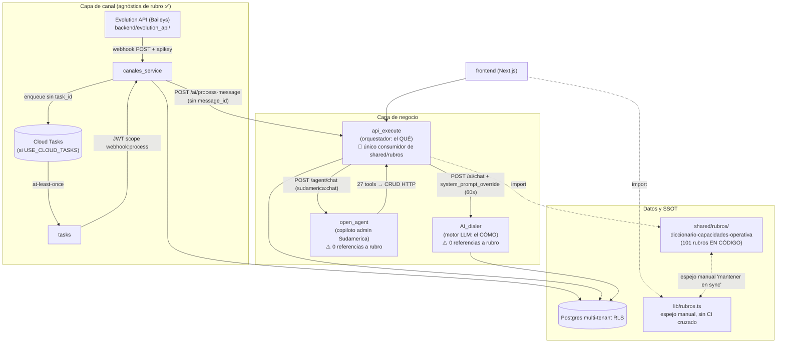
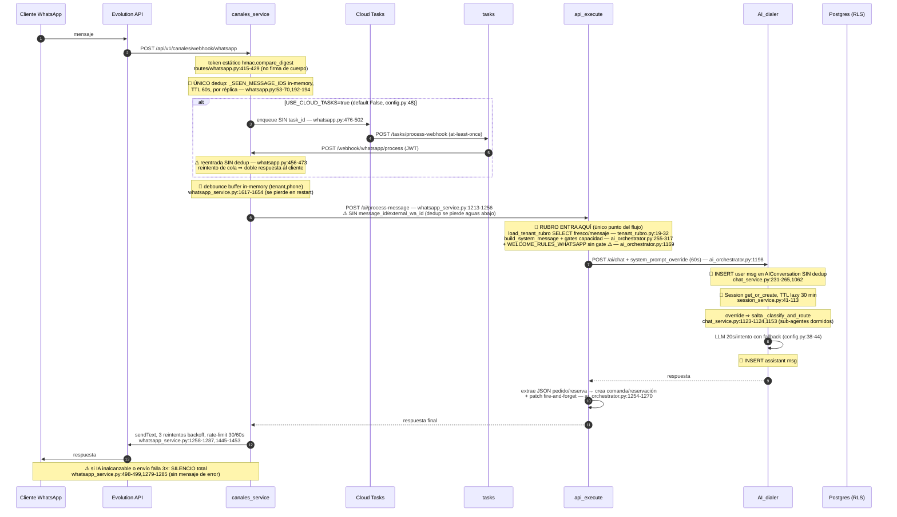

# FASE 1 — DIAGNÓSTICO DE ACOPLAMIENTO MULTI-RUBRO (Sudamérica AI)

> **Fecha:** 2026-07-11 · **Rama:** `main` (monorepo `MVP/`, HEAD `0fedeb6`)
> **Método:** 4 barridos de solo lectura (subagentes Explore) + verificación puntual de evidencia crítica por el modelo principal. Cero modificaciones de código.
> **Sección 0 aprobada:** rubros representativos = restaurante, peluquería, ferretería, veterinaria, hotel · rubro atípico = **inmobiliaria** · tests = `pytest` (backend) / `npm run typecheck && npm run test` (front) · alcance = monorepo `MVP/` + verificación de drift contra `sudamerica-*`.
> Toda afirmación cita `archivo:línea` (rutas relativas a `MVP/`). Lo no evidenciado está en §8 (Hipótesis).

---

## 0. RESUMEN EJECUTIVO

1. **El refactor multi-rubro existente (F0–F7) es real pero parcial *al servicio*, no al sistema.** `api_execute` y el frontend están gateados por rubro/capacidad; `AI_dialer` y `open_agent` son un segundo núcleo de lógica de negocio 100 % restaurante-céntrico (0 ocurrencias de `rubro` en ambos).
2. **La "verdad del rubro" es código, no datos.** 101 rubros viven en `backend/shared/rubros/diccionario.py:114-3274` con espejo manual en `frontend/lib/rubros.ts:168-3618`, sin tabla en BD y **sin test cruzado py↔ts**. Activar un rubro *existente* pasa el Test de los 60 Segundos; crear un rubro *nuevo* exige PR + deploy doble → **falla el test por construcción**.
3. **Gaps de kernel encontrados de paso** (no son de rubro, pero condicionan el plan): idempotencia rota en el camino Cloud Tasks, sin anclaje de versión por conversación, 3 policies RLS públicas (`USING (true)`), mutación de `Tenant.config` inconsistente (merge vs reemplazo), fallo silencioso hacia el cliente WhatsApp.
4. **Producción NO corre el monorepo.** Prod (`sudamerica-prod`) se despliega desde los repos `sudamerica-*` pineados a commits de ~01-07; toda la épica multi-rubro posterior no está en producción. Los golden transcripts de la Fase 3 deben capturarse contra prod, no contra HEAD.

---

## 1. MAPA DE DEPENDENCIAS



**Lista de dependencias (con evidencia):**

- Comunicación inter-servicio: 100 % HTTP vía `SERVICE_*_URL` (`backend/*/app/config.py`), JWT de servicio con scopes/callers (`shared/utils/service_access.py:82,102`). Sin imports cruzados de paquetes `app.*` entre servicios (**sano** ✅).
- `shared/rubros` es importado **solo** por `api_execute` (11 módulos: `prompts_ai.py:13`, `ai_orchestrator.py:27`, `auth_service.py:25`, `comanda_svc.py:26`, `mesa_svc.py:11`, `menu_import_svc.py:26`, `prompt_sections.py:15`, `rubro_prompt.py:12`, `tenant_rubro.py:14`, `routes/onboarding.py:16`, `routes/subentidades.py:13`). Ni `canales_service`, ni `tasks`, ni `open_agent`, ni `AI_dialer` lo conocen.
- **No hay imports invertidos** del core hacia módulos de un rubro concreto (**sano** ✅): el rubro se inyecta como datos (`rubro_def(key)`), nunca como `import peluqueria`.
- `open_agent` NO participa en el flujo WhatsApp del cliente: su único caller autorizado es `api_execute` (`open_agent/app/routes/agent.py:17-19`, `require_service("sudamerica:chat", callers=("api_execute",))`; llamador real: `api_execute/app/services/sudamerica_orchestrator.py:125-132`).

---

## 2. DIAGRAMA DE SECUENCIA — FLUJO WHATSAPP

Leyenda: 💾 persistencia de estado · 🔁 idempotencia · 🎯 entrada de lógica de rubro · ⚠️ riesgo.



**Puntos clave del flujo:**

| Aspecto | Estado | Evidencia |
|---|---|---|
| Idempotencia inbound | Solo in-memory (TTL 60 s, por réplica), **bypasseada** en reentrada Cloud Tasks | `whatsapp.py:53-70,192-194` vs `:456-473` |
| Orden de mensajes | Sin garantía; solo debounce por `(tenant, phone)` in-memory | `whatsapp_service.py:1617-1654` |
| Concurrencia mismo usuario | Sin lock por chat; único lock protege el dict de debounce | `whatsapp_service.py:51` |
| Estado conversacional | `Session` + `AIConversation` en AI_dialer; historial `LIMIT 10` | `session.py`, `ai_conversation.py`, `chat_service.py:579-608` |
| Anclaje de versión | **Inexistente por diseño**: rubro y `AgenteConfig` se leen frescos por mensaje | `tenant_rubro.py:19-32`, `agent_config_service.py:19-50` |
| Reintentos del proveedor | Cubiertos (vuelven a entrar por el webhook con dedup) | `whatsapp.py:192-194` |
| Reintentos de cola interna | **NO cubiertos** (gap crítico) | `whatsapp.py:456-473` + enqueue sin `task_id` `:476-502` |

---

## 3. MATRIZ DE ACOPLAMIENTO

Formato: `| ubicación | mecanismo | rubros afectados | severidad | esfuerzo |`. Severidad **alta** = bloquea el Test de los 60 Segundos o toca al cliente final. 28 fugas accionables + 6 hallazgos positivos de contraste.

### A. Prompts (texto sin gate de rubro que llega a usuarios)

| ubicación | mecanismo | rubros afectados | severidad | esfuerzo |
|---|---|---|---|---|
| `api_execute/app/services/prompt_sections.py:100-108` (`WELCOME_RULES_WHATSAPP`: poll "Ver el menú\|Reservar mesa\|Delivery") inyectada sin condicional en `ai_orchestrator.py:1169` para TODO canal WhatsApp | prompt | todos salvo restaurante | **alta** — es lo primero que ve el cliente de cualquier rubro | S |
| `api_execute/app/prompts_ai.py:270-314` (`_SUDAMERICA_CAPABILITIES`) sin condicional en `sudamerica_admin_prompt` (`:377,385-387`) | prompt | todos salvo restaurante | **alta** | S |
| `api_execute/app/prompts_ai.py:316-338` (`_SUDAMERICA_RULES`) siempre concatenada | prompt | todos salvo restaurante | **alta** | S |
| `api_execute/app/prompts_ai.py:340-361` (`_SUDAMERICA_EXAMPLES`: "Crea 5 mesas…", "¿Qué plato se vende más?") | prompt | todos salvo restaurante | **alta** | S |
| `api_execute/app/services/loyalty_outreach.py:17-29,42` ("Te extrañamos en {restaurante}", "sigue en la carta") disparado en vivo vía `routes/loyalty.py:34` | prompt (mensaje real saliente) | todos salvo restaurante | **alta** | S |
| `api_execute/app/services/prompt_sections.py:110-117` (`WELCOME_RULES_MESA`: "mesero", "Pedir la cuenta") inyectada en `ai_orchestrator.py:343-353` para QR de recurso sin relabel | prompt | rubros con recurso ≠ restaurante | media | S |
| `api_execute/app/services/comanda_notify.py:31-56` (`_STATUS_TEMPLATES`) sin clave `EN_PROCESO` → notificación se pierde en silencio para rubros sin cocina; textos 🍽️/"buen provecho" | prompt + gap funcional | todos salvo restaurante | media | S |
| `api_execute/app/services/sudamerica_orchestrator.py:26` fallback `"tu restaurante"` | prompt | todos salvo restaurante | baja | S |
| `api_execute/app/services/ai_orchestrator.py:191-194` fallback base "…pedidos, reservas…" | prompt | todos | baja | S |

### B. AI_dialer — segundo núcleo ciego al rubro (latente: dormido por `system_prompt_override`, pero código vivo alcanzable por `/api/v1/ai/chat` sin override y `/api/v1/classify`)

| ubicación | mecanismo | rubros afectados | severidad | esfuerzo |
|---|---|---|---|---|
| `AI_dialer/app/services/classify_service.py:39-40` (clasificador de intención: "sistema de atención de restaurantes y negocios gastronómicos") | prompt | todos salvo restaurante | **alta** (latente) | M |
| `AI_dialer/app/services/cotizador_agent.py:12-52` ("asistente de pedidos de un restaurante… como un buen mesero"; fuerza MESA/DELIVERY/RETIRO; uso en `:295`) | prompt | todos salvo restaurante | **alta** (latente) | M |
| `AI_dialer/app/services/seguimiento_agent.py:9-29` ("fidelización de un restaurante") | prompt | todos salvo restaurante | **alta** (latente) | M |
| `AI_dialer/app/services/reservador_agent.py:50-51` + HTTP hardcode a `/api/v1/mesas/disponibilidad` (`:359`) y `/api/v1/core/reservaciones` (`:420`) | prompt + tool | todos salvo restaurante | **alta** (latente) | M/L |
| `grep -rn rubro AI_dialer/ open_agent/` → 0 resultados en código de producto | desconexión estructural | todos salvo restaurante | **alta** | L |

### C. Tools del copiloto admin (open_agent)

| ubicación | mecanismo | rubros afectados | severidad | esfuerzo |
|---|---|---|---|---|
| `open_agent/app/services/tools.py:22-506` (`TOOL_DEFINITIONS`: 27 tools planas, sin filtro por capacidad; incluye `crear_mesa`, `cambiar_estado_comanda`, `crear_reservacion`…) enviadas íntegras al LLM en `agent_engine.py:182` | tool | todos salvo restaurante | **alta** | M |
| `open_agent/app/services/tools.py:29,50,65,88,…` descripciones con "restaurante/menú/plato" literal | tool | todos salvo restaurante | media | S |

### D. Esquema BD / superficie de rutas (naming restaurante sobre mecánica ya generalizada)

| ubicación | mecanismo | rubros afectados | severidad | esfuerzo |
|---|---|---|---|---|
| `infra/013_mesa_qr.sql:22-24` — `qr_token_public_lookup ON mesas USING (qr_token IS NOT NULL)`, `public_read_for_joins ON sucursales USING (true)`, `public_read_for_qr ON evolution_instances USING (true)` → lectura **pública cross-tenant** de 3 tablas; rompe el patrón `tenant_isolation` (`infra/002_rls_policies.sql`) | esquema BD (RLS) | todos (**seguridad**, no rubro) | **alta** | S |
| `shared/models/mesa.py:1-40` — tabla `mesas` (rename a `recursos` diferido según su propio docstring); mecánica ya genérica vía `tipo` (`:39`) y `tipo_recurso_default()` (`operativa.py:79-81`) | esquema BD (naming) | todos | media | M |
| `api_execute/app/models/comanda.py:1,44` — `tipo_entrega: MESA\|DELIVERY\|RETIRO`, campo `numero_mesa` | esquema BD (naming) | todos | media | M |
| `api_execute/app/models/reservacion.py:1` — "restaurant table reservations", FK `mesa_id` | esquema BD (naming) | rubros con agenda ≠ restaurante | baja/media | S |
| `api_execute/app/main.py:93-134` — 7/36 routers explícitamente restaurante (`comandas`, `delivery`, `mesas`×2, `reservaciones`, `mesa_qr`, `ws_kds`) | rutas | todos | baja (gateado aguas arriba) | — |

### E. Duplicación estructural (el hallazgo de fondo)

| ubicación | mecanismo | rubros afectados | severidad | esfuerzo |
|---|---|---|---|---|
| `shared/rubros/diccionario.py` (3.304 líneas) + `lib/rubros.ts` (3.662 líneas, "Espejo… mantener ambos en sync") — doble SSOT en dos lenguajes, sincronización manual, **sin test cruzado en CI** | SSOT duplicado | todos | **alta** | L |
| No existe tabla `rubros` en BD (grep en `infra/*.sql` y `alembic/versions/` sin resultados); `tenant.config` guarda solo la **clave** string (`tenant.py:29`) | manifiesto = código compilado | todos | **alta** — raíz del fallo del Test 60s | L |
| `Tenant.config`/`Sucursal.config` JSONB sin schema de validación (ninguna clase `TenantConfig`; único check: `resolve_rubro` `diccionario.py:3289-3299`) | config sin contrato | todos | media | M |
| `PATCH /tenants/me` hace merge profundo (`tenant_service.py:31-41,63`) pero `PATCH /admin/tenants/{id}` hace reemplazo total (`admin_service.py:154-169`) → un admin puede borrar `rubro`/`billing` sin querer | mutación inconsistente | todos | media (bug latente) | S |

### F. Supuestos implícitos

| ubicación | mecanismo | rubros afectados | severidad | esfuerzo |
|---|---|---|---|---|
| `api_execute/app/config.py:38` — `MP_CURRENCY_ID: str = "CLP"` global (no por tenant/país) | supuesto implícito | todos (Chile-céntrico) | media | M |
| Prompts/tools 100 % español hardcodeado (todos los archivos de §A/§B/§C), sin capa i18n | supuesto implícito | expansión idiomática | media | L |
| Timezone: `grep -rnE "America/"` → 0 resultados; 1 uso residual de `utcnow` | — | — | ✅ no-hallazgo | — |

### G. Frontend

| ubicación | mecanismo | rubros afectados | severidad | esfuerzo |
|---|---|---|---|---|
| `app/(dashboard)/entrenar-ia/page.tsx:141,175` — "plato(s)" hardcodeado, sin `useRubroLabels()` (0 hits en el archivo) | condicional ausente | todos salvo restaurante | media | S |
| Contraste positivo ✅: `lib/nav-config.ts:146,151-155`, `inventario/page.tsx:102`, `capacidades/page.tsx:37`, `carta/page.tsx:77-84,343-347,772-775` — gating/relabel correcto por rubro/capacidad | — | — | — | — |
| `KDSBoard.tsx`, `MesasManager.tsx`, `MenuEngineering.tsx` — restaurante-only pero alcanzables solo con capacidad `mesas` activa | condicional | rubros con mesas | baja | — |

### TOP 10 acoplamientos más graves (orden de impacto)

1. **Doble SSOT de rubro sin persistencia en datos** (E.1 + E.2) — un rubro nuevo siempre requiere PR + deploy en dos lenguajes. Raíz del fallo del Test 60s.
2. **`WELCOME_RULES_WHATSAPP` sin gate** — el primer mensaje de WhatsApp de *cualquier* tenant ofrece menú/mesa/delivery.
3. **AI_dialer 100 % ciego al rubro** (B.*) — segundo núcleo de negocio duplicado y divergente, hoy dormido pero vivo.
4. **`TOOL_DEFINITIONS` sin gate de capacidad** — el copiloto admin puede `crear_mesa` para una inmobiliaria.
5. **Policies RLS públicas de `013_mesa_qr.sql`** — fuga cross-tenant real (seguridad, kernel).
6. **`_SUDAMERICA_*` sin condicional** — back-office habla de platos/mesas para todos.
7. **`loyalty_outreach.py`** — outreach real a clientes con texto de restaurante.
8. **Idempotencia bypasseada en reentrada Cloud Tasks** (kernel, no rubro) — doble respuesta al cliente en reintentos.
9. **`comanda_notify.py` sin `EN_PROCESO`** — camino feliz de notificación roto en silencio para rubros sin cocina.
10. **Naming restaurante en esquema/API** (`mesas`, `comandas`, `tipo_entrega`) — deuda cosmética pero contractual hacia integradores.

---

## 4. REGISTRO DE INVARIANTES (clasificación K/P/E/D — Prueba de los Dos Inquilinos)

| # | Regla | Clase | Evidencia | Justificación | ¿Y si un rubro nuevo necesita lo contrario? |
|---|---|---|---|---|---|
| 1 | Aislamiento multi-tenant RLS (`tenant_isolation`) | **K** | patrón `infra/002_rls_policies.sql`; replicado en `019_rls_delivery.sql`, `005_reservaciones.sql` | Si un rubro pudiera relajarlo, expondría datos de otro tenant | Nunca. **Hoy VIOLADO puntualmente** por `013_mesa_qr.sql:22-24` → corregir en kernel |
| 2 | AuthN/AuthZ inter-servicio (JWT + scopes + callers) | **K** | `shared/utils/service_access.py:82,102`; `open_agent/app/routes/agent.py:17-19` | Superficie de seguridad del sistema | Nunca |
| 3 | Idempotencia de mensajes entrantes | **K** | `whatsapp.py:53-70,192-194`; gap en `:456-473` | Sin ella, doble cobro/doble pedido; ningún rubro puede "querer" duplicados | Nunca. Hoy **incompleta**: in-memory por réplica + bypass en cola |
| 4 | Máquina de sesión WhatsApp (ACTIVE/CLOSED/HUMAN_HANDOFF, get_or_create) | **K** (estructura) | `AI_dialer/app/models/session.py`; `session_service.py:41-113` | El ciclo de vida de sesión es del motor | El *timeout* sí es por-rubro → ver #12 |
| 5 | Facturación SaaS (`config.billing`, grace, MercadoPago) | **K** | `mercadopago_service.py:271-289`; `billing.py:59-60` | Legal/fiscal, cross-tenant | Nunca |
| 6 | Rate-limit de envío (30 msg/60 s por instancia) | **K** (mecanismo) | `whatsapp_service.py:1445-1453` | Protege la instancia WhatsApp y al proveedor | El *valor* podría ser P con techo de kernel |
| 7 | Composición del system prompt (kernel > tenant > rubro) | **K** *(diseño pendiente)* | hoy implícita: orden de concatenación en `ai_orchestrator.py:255-317,343-353,1169,1179`; override reemplaza el prompt del tenant `chat_service.py:1123-1124` | Los guardrails del kernel no deben ser pisables por rubro/tenant | Hoy **no hay mecanismo** que lo impida → entra al diseño de Fase 2 (§preguntas 8-9) |
| 8 | Fail-safe rubro desconocido → `restaurante` | **D** | `diccionario.py:3282-3299`; `tenant_rubro.py:30-32` | ¿Fail-open (degradar a restaurante frente al cliente) o fail-closed (rechazar en publicación)? Decisión de producto | Pregunta H-6 |
| 9 | Labels/vocabulario por primitiva (12 primitivas) | **P** | `diccionario.py:22-52`; consumo en `rubro_prompt.py`, `useRubroLabels.ts:38` | Mismo algoritmo, valores por rubro | Va al manifiesto |
| 10 | Capacidades (22 flags de módulo) | **P** | `capacidades.py:23-75`; gates en `ai_orchestrator.py:286-289`, `nav-config.ts:152` | Flags declarativos puros | Va al manifiesto |
| 11 | Categorías semilla por rubro | **P** | `auth_service.py:137-143`; `diccionario.py` (`categorias_semilla`) | Datos de onboarding | Va al manifiesto |
| 12 | Timeout de sesión, debounce, modelo LLM, auto-respuesta | **P** | `AgenteConfig` vía `agent_config_service.py:19-50` | Valores por tenant, mecanismo del kernel | Va al manifiesto (nivel tenant) |
| 13 | FSM de estados de orden (cocina vs genérica) | **P** *(P si el DSL declara FSM; hoy elección binaria)* | `operativa.py:23-55`; espejo `operativa.ts:21-54` | Hoy 2 FSM fijas elegidas por capacidad MESAS | El manifiesto debe declarar estados/transiciones (Fase 2 §flujos) |
| 14 | Mensajes de bienvenida/polls de WhatsApp | **P** | hoy hardcode: `prompt_sections.py:100-117` | Contenido puro por rubro | Va al manifiesto — **fuga alta hoy** |
| 15 | Plantillas de notificación de estado | **P** | `comanda_notify.py:31-56` | Texto por estado por rubro | Va al manifiesto — gap `EN_PROCESO` hoy |
| 16 | Sub-agentes conversacionales (cotizador/reservador/seguimiento/RAG) | **E** | `chat_service.py:1007-1061`; `_SUB_AGENT_DISPATCH` | Algoritmos genuinamente distintos por rubro en el mismo slot del flujo | Hook/slot del orquestador; hoy hardcode restaurante dormido |
| 17 | Exposición de tools del copiloto por capacidad | **P** (exposición) / **E** (tools nuevas) | `tools.py:22-506`, `agent_engine.py:182` | Filtrar por capacidad es config; tools nuevas por rubro son extensión | Gate por capacidad + registry de tools |
| 18 | Ingesta de catálogo (menu_import) | **E** | `menu_import_svc.py:196,302,480` (usa `load_tenant_rubro`) | Parsers distintos por tipo de catálogo | Hook de ingesta |
| 19 | Moneda de facturación (`MP_CURRENCY_ID`) | **P** (por tenant/país) | `config.py:38` | Hoy global CLP | Config de tenant, no de rubro |
| 20 | Idioma de prompts/UX | **D** | hardcode es-ES en §A/§B/§C | ¿Multi-idioma en roadmap? Afecta si i18n entra al manifiesto | Pregunta H-7 |
| 21 | Anclaje de versión de config por conversación | **D → K propuesto** | inexistente: `tenant_rubro.py:19-32` fresco por mensaje | El super-prompt lo exige para el diseño objetivo (§4.1) | Pregunta H-8; diseño Fase 2 |
| 22 | `get_rubro()` sin uso en producción | **D** (limpieza) | solo `shared/tests/test_rubros.py:49-52` | API pública muerta en camino caliente | Deprecar o adoptar |

---

## 5. PREGUNTAS PARA EL HUMANO (todo lo D o ambiguo — prohibido adivinar)

**Bloque operativo/deploy (bloquean Fase 3):**
- **H-1.** Prod corre `sudamerica-*` pineados (imágenes `:$SHORT_SHA` p. ej. `495b324`) y los deploys están congelados desde ~01/04-07. ¿El plan es (a) re-extraer los `sudamerica-*` desde el monorepo al terminar la épica, (b) desplegar el monorepo directamente, o (c) otro? Define contra qué se capturan los golden transcripts.
- **H-2.** `MVP/deploy.sh` apunta a `melodic-nature-484617-e6` (**suspendido** según tu documentación) y el `gcloud config` local apunta a `sudamerica-prod`. ¿Cuál es el proyecto GCP canónico hoy? ¿Corrijo/retiro `deploy.sh` en Fase 3?
- **H-3.** ¿Cuántas réplicas corre `canales_service` en Cloud Run? Con >1 réplica, dedup y debounce in-memory son por-réplica (riesgo multiplicado). No determinable desde el código.

**Bloque seguridad (recomiendo no esperar a Fase 3):**
- **H-4.** Las policies `public_read_for_joins` (sucursales) y `public_read_for_qr` (evolution_instances) con `USING (true)` (`infra/013_mesa_qr.sql:23-24`): ¿son conscientes y aceptadas, o las tratamos como incidente a corregir de inmediato (fuera de este plan)?

**Bloque producto/diseño (bloquean decisiones de Fase 2):**
- **H-5.** `AI_dialer` (classify + sub-agentes cotizador/reservador/seguimiento/RAG) está dormido en el flujo WhatsApp por `system_prompt_override`. ¿Su futuro es (a) retirarlo (dead code), (b) revivirlo como sistema de sub-agentes por rubro (tipo E), o (c) mantenerlo solo para otros canales?
- **H-6.** Fail-safe de rubro desconocido → `restaurante` (`diccionario.py:3282-3299`): ¿mantener fail-open (nunca se cae, pero una peluquería con typo habla de platos) o pasar a fail-closed en publicación (manifiesto inválido no se publica; runtime nunca ve un rubro inválido)?
- **H-7.** ¿Multi-idioma y multi-moneda están en el roadmap (12-18 meses)? Determina si `idioma`/`moneda` entran al manifiesto de rubro/tenant en Fase 2.
- **H-8.** ¿Confirmas el **anclaje de versión** como requisito (conversación anclada al manifiesto con el que empezó)? Hoy el sistema hace lo contrario por diseño (última versión siempre, `tenant_rubro.py` fresco por mensaje).
- **H-9.** `admin_service.update_tenant` reemplaza `config` completo mientras `tenant_service` hace merge (`admin_service.py:154-169` vs `tenant_service.py:31-41`): ¿intencional o bug? ¿Unifico a merge en Fase 3?
- **H-10.** `Sucursal.config` no tiene ningún lector estructurado en el backend: ¿reservado a futuro o vestigial (candidato a deprecación en el manifiesto)?
- **H-11.** El rubro es hoy estrictamente por-tenant (ninguna sucursal puede diferir). ¿Se mantiene como invariante K en el manifiesto, o hay casos de tenant multi-rubro por sucursal en el horizonte?
- **H-12.** ¿Existen transcripciones reales de conversaciones de prod exportables (para golden transcripts)? Los `evals/fixtures/*.yaml` (restaurante, peluquería, ferretería, veterinaria, carnicería) son sintéticos y corren contra el monorepo, no contra prod.

**Ratificación de alcance (regla №2):** los subagentes necesitaron leer fuera del radio de 2 saltos; cada lectura quedó documentada con motivo: `api_execute/app/{routes,services}/ai_orchestrator.py`, `services/{tenant_rubro,rubro_prompt,sudamerica_orchestrator}.py`, `prompts_ai.py`, `AI_dialer/app/services/{chat_service,session_service,agent_config_service,classify_service,cotizador_agent,seguimiento_agent,reservador_agent}.py`, `AI_dialer/app/models/{ai_conversation,session}.py`, `AI_dialer/app/config.py`. Pendientes de permiso (NO leídos): `AI_dialer/app/models/agente_config.py`, `AI_dialer/app/schemas/config.py`, `backend/evolution_api/**`, cuerpos completos de los 4 sub-agentes, `callback_manual/**`. **H-13.** ¿Ratificas las lecturas hechas y autorizas las pendientes para la Fase 2?

---

## 6. RESPUESTAS A LAS 10 PREGUNTAS CRÍTICAS

**1. ¿Dónde vive hoy la verdad del rubro?** Dispersa en 4 capas: (a) **código Python** — `shared/rubros/diccionario.py:114-3274` (101 rubros: labels, capacidades, semillas, sector) — la fuente principal; (b) **código TS espejo** — `lib/rubros.ts:168-3618` (+ `sector-config.ts` con KPIs solo-frontend, sin equivalente backend); (c) **dato BD** — solo la clave `tenant.config["rubro"]` (`tenant.py:29`, escrita en `auth_service.py:116-130`); (d) **prompts** — parcialmente gateados (`rubro_prompt.py`, `prompt_sections.py:457`) con las fugas de la matriz §A/§B. No hay tabla de rubros en BD.

**2. ¿Quién muere si esto cambia?** Ver Registro de Invariantes (§4): 7 reglas K (intocables), 9 P (al manifiesto), 3 E (hooks), 4 D (preguntas H-*).

**3. ¿Qué corre hoy al crear un tenant?** `auth_service.py:108-145`: `resolve_rubro` (dict in-memory, O(1)) → INSERT `Tenant` con config JSONB → `set_tenant_context` (RLS) → si rubro ≠ restaurante, INSERT de N categorías semilla (N ≤ ~8) → INSERT `Usuario`. **Sin migraciones, sin llamadas externas, sin warm de caché** en este camino. Presupuesto: milisegundos — **el alta de tenant ya es O(1) y pasa el Test de los 60s para rubros existentes**. Lo que NO pasa el test: crear un rubro nuevo (= editar 2 archivos de 3.3k/3.6k líneas + PR + CI + deploy backend y frontend). *No determinable desde el código:* el aprovisionamiento de la instancia de WhatsApp (QR Evolution, `canales_service/app/services/instance_service.py` no auditado a fondo) — probablemente el mayor consumidor real de los 60 s.

**4. ¿Qué pasa con las conversaciones en vuelo?** Usan **siempre la versión más reciente** de config y código: rubro releído por mensaje (`tenant_rubro.py:19-32` desde `ai_orchestrator.py:279`), `AgenteConfig` releído por mensaje (`agent_config_service.py:19-50`, y vía HTTP en `whatsapp_service.py:264-284`). **No existe anclaje de versión.** Un cambio de rubro a mitad de conversación cambia la personalidad del agente en el mensaje siguiente.

**5. ¿Dónde está el techo de expresividad?** Ya expresable como datos: labels (12 primitivas), 22 capacidades, semillas, sector, recurso/variantes/precio_medida, elección entre 2 FSM. **NO expresable hoy** (todo requiere código): (a) flujos conversacionales por rubro — no hay FSM conversacional declarativa: el "flujo" es el LLM + prompt compuesto; (b) validaciones multi-paso de slots; (c) tools por rubro (lista plana global); (d) sub-agentes (§E-16); (e) plantillas de mensajes salientes (bienvenida, estados, loyalty); (f) KPIs/benchmarks (solo frontend); (g) FSM de estados custom (solo cocina|genérica). Este es exactamente el contrato que la Fase 2 debe diseñar.

**6. ¿Quién posee la idempotencia y el orden?** **Nadie de forma completa.** Dedup: solo `canales_service`, in-memory por réplica, TTL 60 s (`whatsapp.py:53-70`), bypasseado en reentrada de cola (`:456-473`), enqueue sin `task_id` (`:476-502`), y el `message_id` no se propaga a `api_execute`/`AI_dialer` (`whatsapp_service.py:1233-1242`; `AIConversation.external_wa_id` existe pero no se popula en vivo). Orden: sin garantía; debounce in-memory como única mitigación. Sin lock por conversación. **Es del kernel y hoy está ausente/duplicado** → candidato #1 a hardening en el plan.

**7. ¿Qué se valida y cuándo?** Casi nada en publicación: `Tenant.config` sin schema (ni Pydantic ni jsonschema); la única validación es `resolve_rubro` con fail-safe **silencioso** a restaurante en runtime (`diccionario.py:3289-3299`, `tenant_rubro.py:30-32`). Un "manifiesto" inválido hoy no explota en onboarding: **degrada frente al cliente** (rubro typo → el agente habla de platos). El principio de Fase 2 ("validación en publicación, no en runtime") hoy se cumple al revés.

**8. ¿Cómo se resuelven los conflictos global vs rubro?** Por **orden de concatenación implícito** en `build_system_message` (`ai_orchestrator.py:255-317`): base prompt → secciones por capacidad → glosario de rubro → welcome rules (sin gate) → format rules (`:1169,1179`). Aguas abajo, `system_prompt_override` **reemplaza** el `system_prompt` del tenant y le anexa `BEHAVIORAL_RULES` (`chat_service.py:1123-1124`). Precedencia real hoy: `override del orquestador > AgenteConfig del tenant`, con el rubro mezclado *dentro* del override. No hay contrato explícito `Kernel > tenant > rubro > defaults`.

**9. ¿Puede un prompt de rubro pisar los guardrails del core?** **Sí, en principio.** Los fragmentos se concatenan como texto plano sin jerarquía dura ni separación de privilegios; nada impide que un `AgenteConfig.system_prompt` de tenant (o un futuro fragmento de manifiesto) contradiga las reglas del kernel — la única "protección" es el orden de concatenación y que `BEHAVIORAL_RULES` va al final (`chat_service.py:1124`). El mecanismo anti-pisado (p. ej. validación de contenido en publicación + secciones inmutables) debe diseñarse en Fase 2.

**10. ¿Cuál es el oráculo de regresión?** (a) `backend/evals/fixtures/{restaurante,peluqueria,ferreteria,veterinaria,carniceria}.yaml` + `evals/eval_gate.sh` — conversacional sintético, por rubro, corre contra el monorepo; (b) tests unitarios de contrato por lenguaje (`shared/tests/test_rubros.py`, `lib/rubros.test.ts`) — unilaterales, sin diff cruzado py↔ts; (c) **no existen golden transcripts de WhatsApp end-to-end reales**, y prod corre commits distintos (drift §7) → hay que capturarlos de prod antes de Fase 3 (pregunta H-12).

---

## 7. DRIFT MONOREPO ↔ PRODUCCIÓN (resumen)

| Servicio | Divergencia (solo-mono / solo-extraído / distintos) | Dirección |
|---|---|---|
| canales_service, tasks, open_agent, callback_manual | 0 / 0 / 0 | sin drift |
| AI_dialer | 0 / 0 / 1 (`chat_service.py`, hardening) | mono adelante |
| api_execute | **13 / 0 / 21** (toda la épica rubros/subentidades) | mono muy adelante |
| shared/ (6 copias vendorizadas en `sudamerica-*`) | falta `rubros/`, `enums.EN_PROCESO`, `mesa.tipo` | mono adelante |

- Monorepo = **superconjunto estricto** (0 archivos más nuevos solo en extraídos) → válido como fuente de autoría del análisis.
- Prod (`sudamerica-prod`) desplegado desde `sudamerica-*` con imágenes `:$SHORT_SHA` (commits `495b324`, `3a22c9c`, `e52af4c` verificados en los repos extraídos); congelado ("CERO deploy") desde ~01/04-07; frontend pineado `frontend-00031-n5d`.
- `MONOREPO_ORIGIN.md` declara flujo mono→extraído, pero hubo autoría directa en extraídos portada al mono (commits espejo 2026-07-01 15:18:06).
- ⚠️ `MVP/deploy.sh` → proyecto `melodic-nature-484617-e6` (suspendido); `gcloud config` local → `sudamerica-prod`. Ver preguntas H-1/H-2.

---

## 8. HIPÓTESIS (registradas, no afirmadas)

1. Réplicas de Cloud Run >1 harían dedup/debounce por-réplica (no confirmable desde el repo) — H-3.
2. El `RetryConfig` de la cola `whatsapp-webhooks` vive en infra fuera del repo; reintentos exactos desconocidos.
3. `call_llm_with_fallback` implementa fallback OpenAI→Gemini (inferido de `AI_dialer/app/config.py:38-44`; cuerpo no leído).
4. La divergencia merge/reemplazo de `Tenant.config` (H-9) parece bug, no diseño.
5. `Sucursal.config` y `AgenteConfig.config` parecen JSONB libres sin contrato, patrón repetido (H-10; `agente_config.py` no leído — permiso pendiente).
6. El equipo del refactor F0–F7 no tuvo mandato sobre `AI_dialer`/`open_agent` (explica la cobertura parcial); nuevos duplicados aparecerán si se toca un servicio sin auditar los demás.
7. El congelamiento de deploys es deliberado para validar la épica multi-rubro antes de re-extraer/redeployar.

---

## 9. PROPUESTA DE `CLAUDE.md` (condensado para sesiones futuras)

```markdown
# Sudamérica AI — Mapa arquitectónico condensado (generado en Fase 1, 2026-07-11)

## Qué es
SaaS ERP multi-tenant con interfaz conversacional WhatsApp. Monorepo `MVP/`
(autoría) + repos `sudamerica-*` (deploy prod, pineados). Prod GCP: `sudamerica-prod`.
⚠️ `MVP/deploy.sh` apunta a un proyecto SUSPENDIDO — no ejecutar sin confirmar.

## Flujo WhatsApp (el único que importa para el cliente)
Evolution API → canales_service (webhook, dedup in-memory 60s)
  → [Cloud Tasks → tasks → canales_service SIN dedup ⚠️]
  → api_execute/ai_orchestrator (RUBRO ENTRA AQUÍ: tenant_rubro.py, fresco por mensaje)
  → AI_dialer (Session + AIConversation; system_prompt_override salta sub-agentes).
open_agent = copiloto admin (Sudamerica), NO atiende WhatsApp de clientes.

## La verdad del rubro
- 101 rubros EN CÓDIGO: `backend/shared/rubros/diccionario.py` (SSOT py)
  + espejo manual `frontend/lib/rubros.ts` (SIN test cruzado — riesgo).
- BD solo guarda la clave: `tenant.config["rubro"]` (JSONB sin schema).
- Fail-safe silencioso a "restaurante" (`resolve_rubro`). Rubro por-tenant, nunca por-sucursal.
- Capacidades (22 flags) gatean módulos: `capacidades.py` / `nav-config.ts`.
- FSM de órdenes: `operativa.py` (cocina vs genérica según capacidad `mesas`).

## Dónde está el acoplamiento restaurante (Fase 1, matriz completa en docs/arquitectura/fase1-diagnostico.md)
- Prompts sin gate: WELCOME_RULES_WHATSAPP (prompt_sections.py:100), _SUDAMERICA_* (prompts_ai.py:270-361),
  loyalty_outreach.py, comanda_notify.py (falta EN_PROCESO).
- AI_dialer entero (classify/cotizador/reservador/seguimiento) — dormido por override, pero vivo.
- open_agent/tools.py: 27 tools sin gate de capacidad.
- Naming BD: mesas/comandas/tipo_entrega (mecánica ya genérica).

## Reglas para tocar este repo
- Tests: `cd MVP/backend && pytest` · front: `npm run typecheck && npm run test`.
- Toda tabla nueva replica policy `tenant_isolation` (patrón infra/002; NO imitar 013_mesa_qr.sql:22-24 ⚠️).
- Restaurante = comportamiento byte-idéntico (backwards-compat es criterio de aceptación).
- Espejos py↔ts de rubros/capacidades/operativa: cambiar SIEMPRE ambos lados.
- Golden transcripts + evals (`backend/evals/eval_gate.sh`) antes de tocar prompts.
```

---

*Fin del entregable de Fase 1. Pendiente: **⛔ STOP GATE 1** — aprobación explícita del humano para pasar a Fase 2 (diseño del manifiesto y orquestador).*
